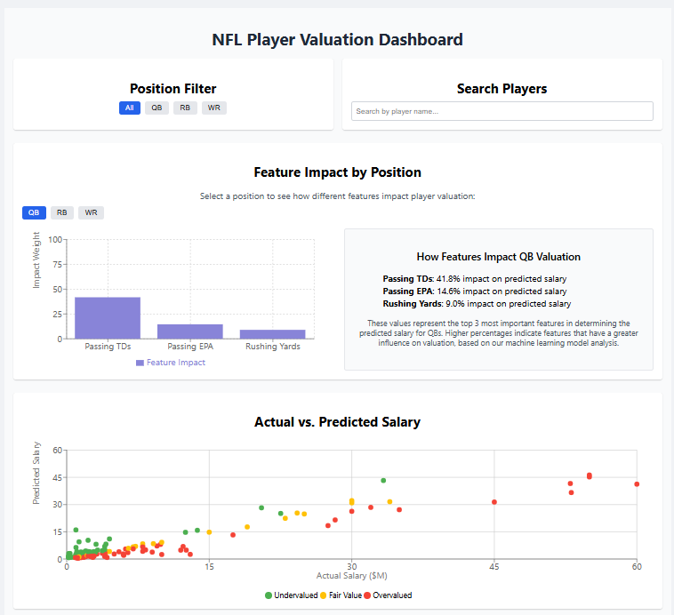

# NFL Player Valuation Dashboard

This dashboard provides analytical tools to evaluate NFL player contracts and performance metrics. It displays player valuation analysis, salary comparisons, performance metrics, and position-based market overviews.

This project was bootstrapped with [Create React App](https://github.com/facebook/create-react-app).



## Features

- 📊 **Salary Analysis**: Compare actual vs. predicted player salaries
- 🔍 **Player Filtering**: Filter players by position and search by name
- 📈 **Feature Impact Visualization**: See which metrics most influence player valuation
- 📋 **Detailed Player Table**: Sortable table with valuation metrics for all players
- 📊 **Radar Charts**: Compare player metrics against position averages
- 📈 **Position Market Overview**: Analyze market trends by position

## Getting Started

### Prerequisites

- Node.js (v14.0 or later)
- npm (v6.0 or later)

### Installation

1. Clone the repository:
   ```
   git clone https://github.com/your-username/nfl-player-valuation-dashboard.git
   cd nfl-player-valuation-dashboard
   ```

2. Install dependencies:
   ```
   npm install
   ```

3. Create a `public/data` directory if it doesn't exist:
   ```
   mkdir -p public/data
   ```

4. Place your `dashboard_data.csv` file in the `public/data` directory or use the sample data generation feature built into the app.

### Running Locally

Start the development server:
```
npm start
```

The application will open in your default browser at [http://localhost:3000](http://localhost:3000).

If no CSV data is found, the application will automatically generate sample data for testing purposes.

## CSV Data Format

The dashboard expects a CSV file with the following columns:
- `name`: Player name
- `position`: Player position (QB, RB, WR, TE, OL)
- `height`: Player height in inches
- `weight`: Player weight in pounds
- `feature_1`, `feature_2`, `feature_3`: Position-specific performance metrics
- `actual_salary`: Current salary in millions of dollars
- `predicted_salary`: Model-predicted salary in millions of dollars

## Deployment

### Deploying to GitHub Pages

1. Add GitHub Pages dependency:
   ```
   npm install --save-dev gh-pages
   ```

2. Add the following scripts to your `package.json`:
   ```json
   "scripts": {
     "predeploy": "npm run build",
     "deploy": "gh-pages -d build",
     ...
   }
   ```

3. Add the homepage field to your `package.json`:
   ```json
   "homepage": "https://your-username.github.io/nfl-player-valuation-dashboard",
   ```

4. Deploy the application:
   ```
   npm run deploy
   ```

5. The dashboard will be available at `https://your-username.github.io/nfl-player-valuation-dashboard`

### Environment Variables

If you need to customize the application based on the environment, you can create a `.env` file:

```
REACT_APP_API_URL=your_api_url_here
PUBLIC_URL=your_public_url_here
```

## Customizing Data

### Using Your Own Data Source

To use your own data source instead of the default CSV file:

1. Modify the `loadPlayerDataFromCSV` function in `dataUtils.js` to connect to your API or database
2. Ensure your data adheres to the expected format or transform it in `processPlayers`

### Modifying Feature Labels

Position-specific feature labels can be customized in the `getFeatureLabels` function in `dataUtils.js`.

## Troubleshooting

### CSV Loading Issues

If you encounter issues loading your CSV data:

1. Check that your CSV file is correctly formatted with headers matching those expected by the application
2. Ensure the file is placed in the correct location (`public/data/dashboard_data.csv`)
3. Check browser console for specific error messages

### Rendering Problems

If charts or visualizations don't render correctly:

1. Verify that your data contains valid numerical values for all required fields
2. Check your browser console for any JavaScript errors
3. Ensure your screen size meets the minimum requirements (responsive design works best on screens 768px and above)

## Contributing

Contributions are welcome! Please feel free to submit a Pull Request.

## License

This project is licensed under the MIT License - see the LICENSE file for details.

## Acknowledgements

- Data processed using Exponential Smoothing and ML-based Valuation Models
- Part of CSE 6242 Project - Group 165
